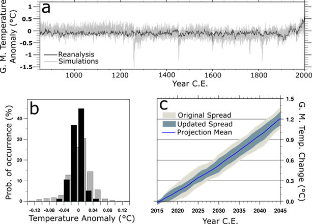

# beyondpingpong
A possible thing to look at during the Heidelberg Workshop.

The codes and data in this repository will result in something like the figure below. The NCL code was used to do the actual analysis, then Inkscape was just to make the plot look cleaner. I've tried to translate it to a python notebook, but it hasn't got anywhere near as far and doesn't yet have the required bandpass filtering included. 

*Pilot work demonstrating the potential for projection variance calibration using the past 1000 years. (a) Annual, global mean temperature anomalies in from the last millennium reanalysis and simulations. (b) Distribution of multidecadal anomalies in both datasets. (c) Multidecadal projections before and after the variance calibration.*
